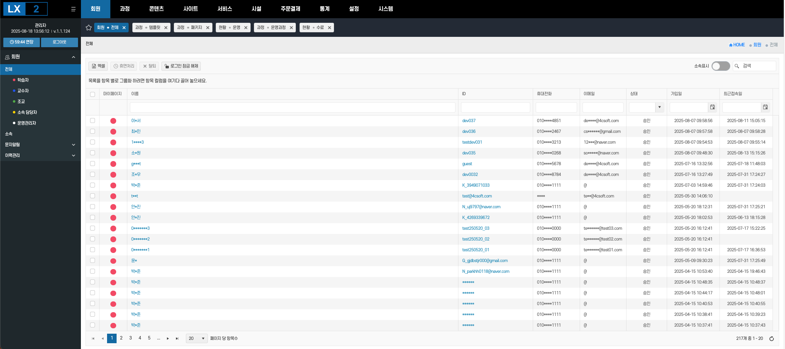

<nav class="uc-nav">
  
LX2

  <ul class="links">
    <li><a href="#features">주요기능</a></li>
    <li><a href="#faq">FAQ</a></li>
    <li><a href="#partners">파트너</a></li>
    <li><a href="#contact">도입 문의</a></li>
  </ul>
  

    
    
  

</nav>
> [!hero]  
> # AI 기반 맞춤형 학습관리 시스템  
> 국내 최고 기관·기업에 검증된 통합 교육시스템으로  
> 모든 교육업무를 처리하는 원스탑 통합 교육 시스템을 구축합니다.  
>
> [LX2 소개서 ↗](#){.btn .primary}  [바로 체험하기 ▶](#){.btn}
>
> {.hero-img}

<!-- 우측 떠 있는 카드 버튼 -->

  <a href="#" class="fab-card">솔루션 소개서</a>
  <a href="#" class="fab-card">바로 체험하기</a>

