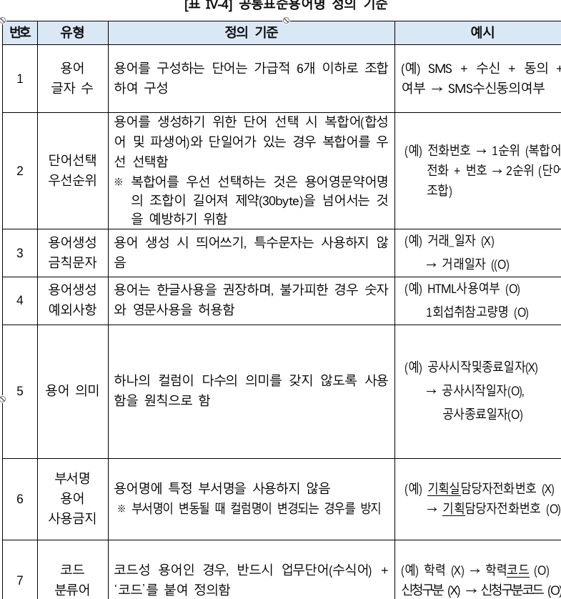

# 대메뉴
> [!big] 대메뉴 섹션
> 텍스트…
> 
> 

## 중메뉴
> [!mid] 중메뉴 섹션 테스트 이미지

## 중메뉴
> [!mid] 중메뉴 섹션
> 

### 소메뉴
> [!small] 소메뉴 섹션
> 

/* 콜아웃별 이미지 크기 */
.callout[data-callout="big"] img { width: 600px; height: auto; border-radius: 12px; object-fit: cover; }
.callout[data-callout="mid"] img { width: 420px; height: auto; border-radius: 10px; object-fit: cover; }
.callout[data-callout="small"] img { width: 260px; height: auto; border-radius: 8px;  object-fit: cover; }

/* 옵시디언 뷰 공통: 여백/정렬(선택) */
.callout[data-callout="big"] img,
.callout[data-callout="mid"] img,
.callout[data-callout="small"] img { display:block; margin:10px 0; }

